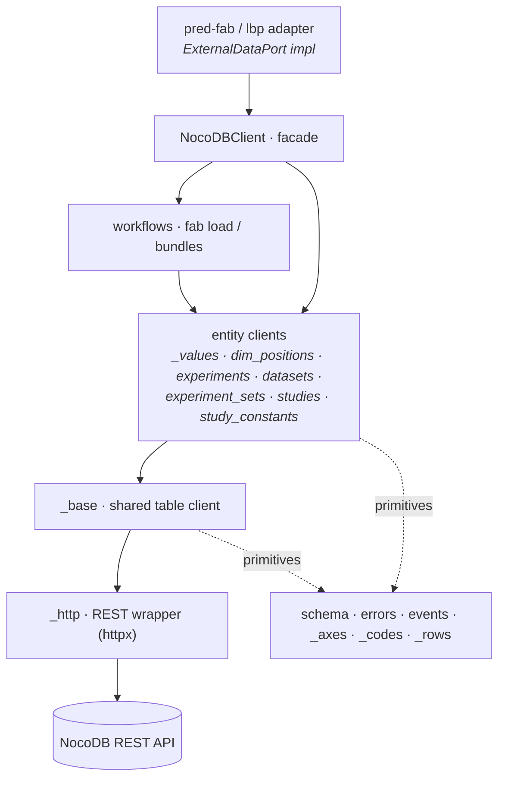

# pred-fab-nocodb

NocoDB binding for the pred-fab data model.

- **Purpose** — typed read/write access to a NocoDB workspace structured per the pred-fab schema (studies, experiments, params, features, attributes, dim_positions, experiment_sets).
- **Owns** — the storage boundary: table clients, row-code generation, axis canonicalisation, the HTTP wrapper.
- **Out of scope → who** — the data model + science (`pred-fab`); fab execution (`learning-by-printing`). This repo is schema-agnostic storage — it stores values, it does not type them (see [[PFAB code audit 2026-06]] §B6: coercion is the consumer's job).
- **Depends on** — NocoDB (external); mirrors pred-fab value objects (`ParameterUpdateEvent`). See [[Repo Dependency Graph]].

## Architecture

Three tiers — primitives < transport < domain clients < facade — kept honest by
the `import-linter` contracts in `.importlinter` (run `lint-imports`; ready to wire into CI/pre-commit — neither exists in this repo yet).
Arrows = depends-on (imports); a tier imports only those below it.

Contracts enforced: transport (`_http`/`_base`) imports no client; primitives
import no client; only the package root constructs the facade. `workflows`
keeps a `TYPE_CHECKING`-only reference to `NocoDBClient` (it is handed a client
at construction), so that back-edge is intentionally allowed.

## Consumers
- `learning-by-printing/` — pushes experiment results to NocoDB after a fab run
- fabrication scripts — read parameters before running an experiment, update status during/after

## Layout

| Path | Contents |
| ---- | -------- |
| `src/pred_fab_nocodb/schema.py` | Table and column name constants, `Status` enum |
| `src/pred_fab_nocodb/client.py` | Public `NocoDBClient` entry point |
| `src/pred_fab_nocodb/errors.py` | Exception types |
| `src/pred_fab_nocodb/_http.py` | HTTP wrapper (auth, error mapping) — internal |
| `src/pred_fab_nocodb/_base.py` | `_BaseTableClient` shared base — internal |
| `src/pred_fab_nocodb/_axes.py` | Axes canonicalisation (sorted-key JSON) — internal |
| `src/pred_fab_nocodb/_codes.py` | Row-code generators per table (`make_dim_position_code`, `make_value_code`, …) — internal |
| `src/pred_fab_nocodb/_values.py` | `ValueClient` for params / features / attributes |
| `src/pred_fab_nocodb/studies.py` | `StudiesClient` + `Study` dataclass |
| `src/pred_fab_nocodb/experiments.py` | `ExperimentsClient` + `Experiment` dataclass |
| `src/pred_fab_nocodb/datasets.py` | `DatasetsClient` + `Dataset` dataclass |
| `src/pred_fab_nocodb/experiment_sets.py` | `ExperimentSetsClient` + `ExperimentSet` dataclass — named groups (members as JSON, link-free); supersedes `datasets` |
| `src/pred_fab_nocodb/config_params.py` | `ConfigParamsClient` + `ConfigParam`/`ConfigType` + `coerce_value` — the single-SSOT config catalog (value-preserving upsert; type-driven coercion) |
| `src/pred_fab_nocodb/_rows.py` | Shared row-field parsers (`_resolve_link_id` / `_resolve_link_code` / `_parse_dt`) — internal |
| `src/pred_fab_nocodb/dim_positions.py` | `DimPositionsClient` + `DimPosition` dataclass |
| `src/pred_fab_nocodb/study_constants.py` | `StudyConstantsClient` |
| `src/pred_fab_nocodb/workflows.py` | `WorkflowsClient` + payload dataclasses (`FabricationLoad`, `ExperimentBundle`, `ExperimentPlan`). Trajectory projection to a schedule axis lives on `FabricationLoad.as_overrides(schedule_dim=…)` |
| `src/pred_fab_nocodb/events.py` | `ParameterUpdateEvent` — sparse trajectory value object, mirrored from pred-fab |
| `src/pred_fab_nocodb/schema_validator.py` | `SchemaValidator` — recursive diff + `assert_compatible` for study schema dicts |

## Key points

- All client methods raise from `errors.py` on failure; no silent fallbacks.
- `dim_positions` codes generated as `'{domain}.d{depth}.{count}'`; counter is per-`(domain, depth)`.
- `axes` JSON stored canonically (sorted keys, no whitespace) to enable `UNIQUE(domain, axes)`.
- `ValueClient` is one parameterised class used by `params`, `features`, `attributes` (identical table shape).
- `_NocoDBHttp` (`_http.py`) is the only direct REST surface; tests substitute a fake.

## Open risks

- Counter generation under concurrent writes — currently relies on sequential pipelines. Add retry-on-conflict if multi-writer becomes real.
- NocoDB JSONB column type may differ across versions; canonicalisation in `_axes.py` is the contract for `UNIQUE(domain, axes)`.
